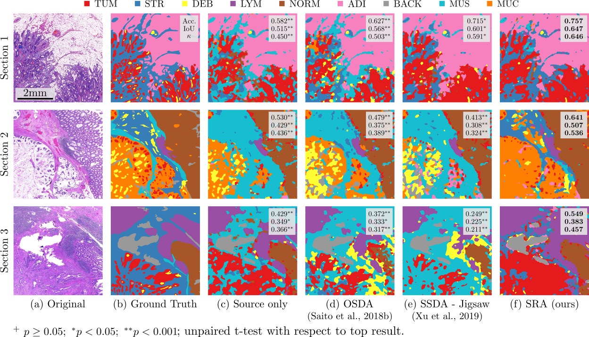

# Self-Rule to Adapt (SRA)

Pytorch implementation of [SRA]()


Acquiring large amounts of labeled data is often not feasible in medical image analysis, 
which can pose a problem when working with supervised deep learning. While asking expert 
pathologists to annotate a subset of the cohort is feasible, annotating all of the images 
is impractical, as it is highly time-consuming. Using available open-source data 
for pre-training or transfer learning can be a way to overcome this issue.
However, these pre-trained deep networks often fail to generalize to new test domains 
that are not distributed identically to the training data due to variations in tissue 
stainings, types, and textures. In this work, we take the steps towards addressing 
these challenges. First, we evaluate and analyze multiple self-supervised learning 
methods on two source datasets of colon cancer tissue images using only a fraction of 
the available labels. Second, we propose Self-Rule to Adapt, a self-supervised learning 
approach for domain adaptation that can effectively transfer the discriminative knowledge 
obtained from a few labeled samples of given source domains to the target domain without 
requiring any additional tissue annotation at the target site and further validate our 
approach on our in-house clinical cohort. Unlike existing domain adaptation techniques that 
rely only on the label-rich source domain's supervision, our method harnesses both domains' 
cluster structures by capturing visual similarity with intra-domain and cross-domain 
self-supervision. We show through extensive experiments that Self-Rule to Adapt outperforms 
baselines across unsupervised and self-supervised domain adaptation settings. 


## Requirements
Dataset:
* [Kather16](https://zenodo.org/record/53169): Collection of textures in colorectal cancer 
histology containing 5000 histological images
* [Kather19](https://zenodo.org/record/1214456): 100,000 histological images of human colorectal cancer 
and healthy tissue

Python
* pytorch = 1.2.0
* torchvision = 0.4.0


## Usage
The pre-trained (Kather19 to Kather16) model is available on the google drive [link](TODO). 

To train the model :
```bash
python train_sra.py ...
```
To evaluate and plot t-SNE.
```bash
python eval_sra.py ...
```
...

## Results

We present the t-SNE projection of the results of domain adaptation processes from Kather19 
to Kather16.


To validate our approach on real case scenario, we perform domain adaptation using our 
proposed model from [Kather19](https://zenodo.org/record/1214456) to whole slide image 
sections from our in-house dataset. The results are presented here, alongside the original 
H&E image, their corresponding labels annotated by an expert pathologist, as well as 
comparative results of previous approaches smoothed using conditional random fields as 
in [L. Chan](https://github.com/lyndonchan/hsn_v1) (2018). The sections were selected such that, 
overall, they represent all tissue types equally.

