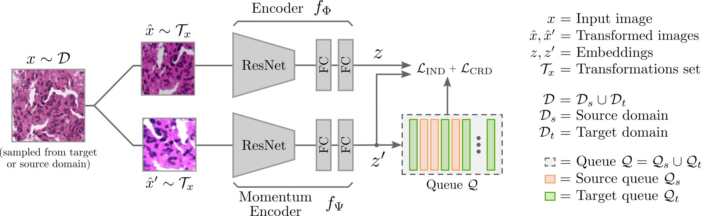
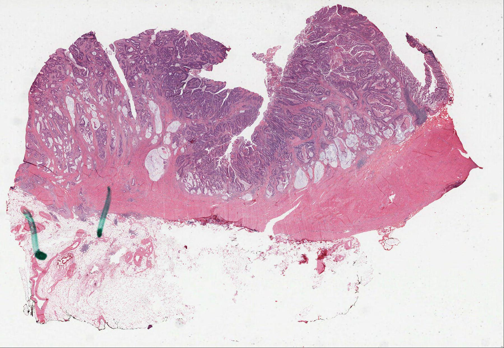
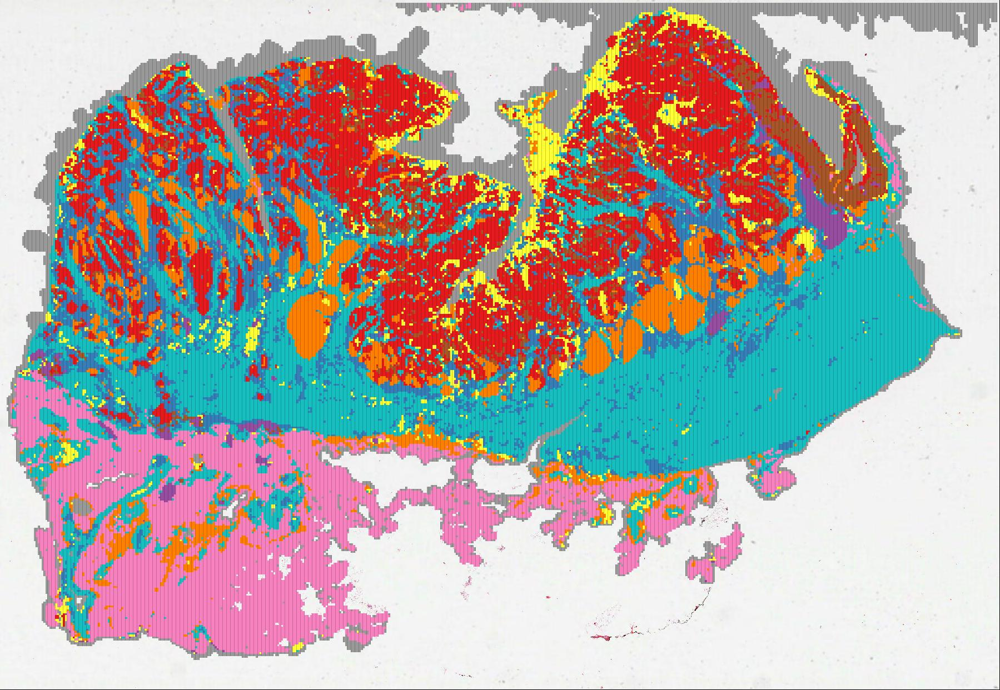
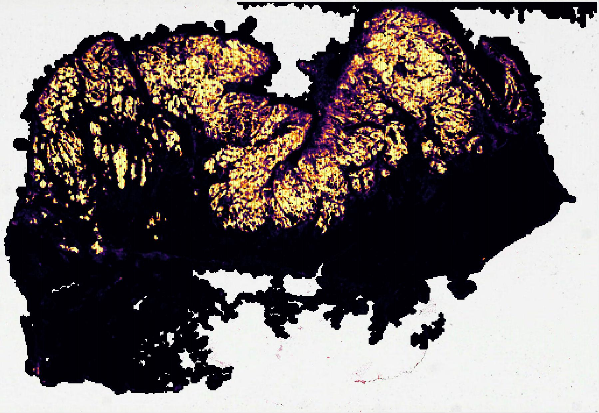
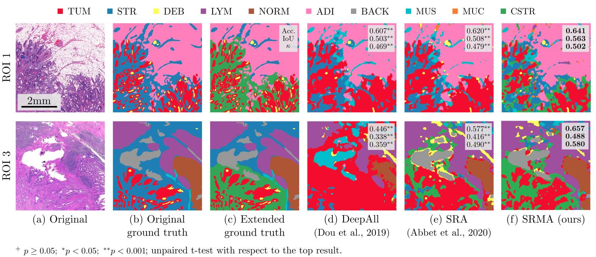

# Pytorch implementation Self-Rule to Adapt (SRA):
## Self-Rule to Adapt: Generalized Multi-source Feature Learning Using Unsupervised Domain Adaptation for Colorectal Cancer Tissue Detection

### [Lab](https://www.epfl.ch/labs/lts5/) | [Paper (June 2021)](https://openreview.net/forum?id=VO7asaS5GUk) | [Journal (May 2022)](https://www.sciencedirect.com/science/article/pii/S1361841522001207) | [Application (April 2022)](https://openreview.net/forum?id=PMQZGFtItHJ)

Supervised learning is constrained by the availability of labeled data, which are especially expensive to acquire in 
the field of digital pathology. Making use of open-source data for pre-training or using domain adaptation can be a 
way to overcome this issue. However, pre-trained networks often fail to generalize to new test domains that are not 
distributed identically due to variations in tissue stainings, types, and textures. Additionally, current domain 
adaptation methods mainly rely on fully-labeled source datasets.

In this work, we propose SRA, which takes advantage of self-supervised learning to perform domain adaptation and 
removes the necessity of a fully-labeled source dataset. SRA can effectively transfer the discriminative knowledge 
obtained from a few labeled source domain's data to a new target domain without requiring additional tissue annotations. 
Our method harnesses both domains' structures by capturing visual similarity with intra-domain and cross-domain 
self-supervision. Moreover, we present a generalized formulation of our approach that allows the architecture to learn 
from multi-source domains. We show that our proposed method outperforms baselines for domain adaptation of colorectal 
tissue type classification and further validate our approach on our in-house clinical cohort. The code and models are 
available open-source:




---
## Usage & requirements

In this section, we present how to use SRA to train your own architecture. Please, first clone the repo and install the 
dependencies.

```bash
# To clone the repo
git clone git@github.com:christianabbet/SRA.git
cd SRA

# Create environment and activate it
conda create --name sra python=3.8 -y
conda activate sra

# Install pytorch 
conda install -y pytorch==1.6.0 torchvision==0.7.0 -c pytorch

# Install other packages
conda install -y matplotlib shapely tqdm tensorboard==2.3.0
pip install albumentations openslide-python
pip install git+https://github.com/lucasb-eyer/pydensecrf.git
```


### Pretrained models

You can download part of the model used for the publication. The `pretrained` version is composed of the two branches 
of the architecture without the linear classifier. The `classification` model is only composed of one branch as well as 
the classification (source) layer. We indicate the source and target dataset used for each training.

<table>
  <tr>
    <th>Arch</th>
    <th>Source</th>
    <th>Target</th>
    <th>n classes</th>
    <th colspan="2">download</th>
  </tr>
  <tr>
    <td>sra</td>
    <td>Kather19</td>
    <td>In-house</td>
    <td>9</td>
    <td><a href="https://drive.google.com/file/d/1U8L45e38XKVonrrQVlMeb_twje4_kY_S/view?usp=sharing">pretrained</a></td>
    <td><a href="https://drive.google.com/file/d/1h4J4t4C7frYb_mL6FeRGCi0f_MhCutHp/view?usp=sharing">classification</a></td>
  </tr>
  <tr>
    <td>srma</td>
    <td>Kather19</td>
    <td>In-house</td>
    <td>9</td>
    <td><a href="https://drive.google.com/file/d/1QnWbRTF6xme8xovTvZGBFnCU-8abENI2/view?usp=sharing">pretrained</a></td>
    <td><a href="https://drive.google.com/file/d/1B3c4eBcYOZQMcIF-U8Dfu0UM7DRO0qMu/view?usp=sharing">classification</a></td>
  </tr>
  <tr>
    <td>sra</td>
    <td>Kather19 + CRCTP</td>
    <td>In-house</td>
    <td>10</td>
    <td><a href="https://drive.google.com/file/d/1hAnLMzdCBRLiN3uWVlTDuT7A1sdKZSx2/view?usp=sharing">pretrained</a></td>
    <td><a href="https://drive.google.com/file/d/177OrAq0dOd6IoifUr5BSry0s_HnV1c6-/view?usp=sharing">classification</a></td>
  </tr>
  <tr>
    <td>srma</td>
    <td>Kather19 + CRCTP</td>
    <td>In-house</td>
    <td>10</td>
    <td><a href="https://drive.google.com/file/d/1MfALpMByH-2mTGwYCJt6bz7ydybZHaCT/view?usp=sharing">pretrained</a></td>
    <td><a href="https://drive.google.com/file/d/1vQjlr6SB0yTHLhuQNjB-gJM5S3TjI-0V/view?usp=sharing">classification</a></td>
  </tr>
</table>

---

## Training

### Step 1: Download publicly available data (source)
Here is a non-exhaustive list of the publicly available dataset of colorectal tissues:


<table>
  <tr>
    <th>Name</th>
    <th>#Samples</th>
    <th>#Classes</th>
    <th colspan="2">Links</th>
  </tr>
  <tr>
    <td>Kather16</td>
    <td>5,000</td>
    <td>8</td>
    <td><a href="https://zenodo.org/record/53169">download</a></td>
    <td><a href="https://www.nature.com/articles/srep27988">paper</a></td>
  </tr>
  <tr>
    <td>Kather19</td>
    <td>100,000</td>
    <td>9</td>
    <td><a href="https://zenodo.org/record/1214456">download</a></td>
    <td><a href="https://journals.plos.org/plosmedicine/article?id=10.1371/journal.pmed.1002730">paper</a></td>
  </tr>
  <tr>
    <td>CRCTP</td>
    <td>196,000</td>
    <td>7</td>
    <td><a href="https://warwick.ac.uk/fac/cross_fac/tia/data/crc-tp">download</a></td>
    <td><a href="https://www.sciencedirect.com/science/article/pii/S136184152030061X">paper</a></td>
  </tr>
</table>
  
You can download the previous dataset using the commands:
[Dec 2023] !!! The CRCTP is not publicly available anymore !!!
```bash
# Create data folder
mkdir data

# Download Kather16 training/test data
wget -O Kather_texture_2016_image_tiles_5000.zip https://zenodo.org/record/53169/files/Kather_texture_2016_image_tiles_5000.zip?download=1
unzip Kather_texture_2016_image_tiles_5000.zip && rm Kather_texture_2016_image_tiles_5000.zip
mv Kather_texture_2016_image_tiles_5000 data

# Download Kather19 training data
wget -O NCT-CRC-HE-100K.zip https://zenodo.org/record/1214456/files/NCT-CRC-HE-100K.zip?download=1
unzip NCT-CRC-HE-100K.zip && rm NCT-CRC-HE-100K.zip
mv NCT-CRC-HE-100K data

# Download CRCTP training/test data (Before Dec 2023)
wget -O fold2.zip https://warwick.ac.uk/fac/cross_fac/tia/data/crc-tp/fold2.zip
7z x fold2.zip && rm fold2.zip
mv Fold2 data/CRCTP
```

###  Step 2: Create your Dataset (target)

To perform domain alignment, we need to create a target set. To do so, either use your own dataset or generate one using 
the following script. The `data_query` should indicate the query to the target whole slides images (*.mrxs, *.svs, ...). 
The script extracts from each whole slide `n_subset` tiles picked at random from the foreground and saves them under 
`export` path.

```bash
python create_targets.py --data_query "/path/to/data/*.mrxs" --export data/GENERATED_TARGETS --n_subset 200
```

### Step 3: Train the model

To train the model with single-source domain:
```bash
# Define variables
DATASET_SRC="data/NCT-CRC-HE-100K"
DATASET_TAR="data/GENERATED_TARGETS"
# Train unsupervised architecture
python train_sra.py --root "${DATASET_SRC}:${DATASET_TAR}" --exp_name sra_k19
# Train linear classifier on top
# Note: You can use the model provided on the google drive (checkpoint_sra_k19_inhouse.pth)
python train_sra_cls.py --name="kather19" --root "${DATASET_SRC}" --loadpath=best_model_sra_k19.pth
```

To train the model with multi-source domain:
```bash
# Define variables
DATASET_SRC1="/data/CRCTP/Training"
DATASET_SRC2="data/NCT-CRC-HE-100K"
DATASET_TAR="data/GENERATED_TARGETS"
# Train unsupervised architecture
python train_sra.py --root="${DATASET_SRC1}:${DATASET_SRC2}:${DATASET_TAR}"  --exp_name sra_crctp_k19
# Train linear classifier on top
# Note: You can use the model provided on the google drive (checkpoint_sra_crctp_k19_inhouse.pth)
python train_sra_cls.py --name="crctp-cstr+kather19" --root "${DATASET_SRC1}:${DATASET_SRC2}" --loadpath=/path/to/pretrained/model.pth
```

### Step 4: WSIs Classification

The pre-trained models (with and without the linear classifier) are available in the pretrained moodle section. Here 
we show how to classify a [slide](https://portal.gdc.cancer.gov/files/2d961af6-9f08-4db7-92b2-52b2380cd022
) taken from the TCGA cohort. The slides are available for download.

```bash
# Infer WSI using K19 label
python infer_wsi_classification.py \
  --wsi_path TCGA-CK-6747-01Z-00-DX1.7824596c-84db-4bee-b149-cd8f617c285f.svs \
  --model_path best_model_srma_cls_k19.pth \
  --config conf_wsi_classification_k19.yaml

# Infer WSI using K19+CRCTP label
python infer_wsi_classification.py \
  --wsi_path TCGA-CK-6747-01Z-00-DX1.7824596c-84db-4bee-b149-cd8f617c285f.svs \
  --model_path best_model_srma_cls_k19crctp.pth \
  --config conf_wsi_classification_k19crctp.yaml
```

To run the prediction on multiple slides, you can use unix-like queries. Be careful to use the **quotes** around 
the `wsi_path` argument as below.
```bash
python infer_wsi_classification.py \
  --wsi_path "/PATH/TO/DATA/*.svs" \
  --model_path best_model_srma_cls_k19.pth \
  --config conf_wsi_classification_k19.yaml
```

You can find the predictions under the `outputs` folder.

### Step 5: QuPath Visualization

You can visualize the predictions using [QuPath](https://qupath.github.io/). To do so, follow the steps:
1. Open QuPath 
2. Open the WSIs image (*.mrsx, *.svs, ...)
3. Select `Automate->Show script editor`
4. Copy paste the script located under `SRA/script_qupath/annotation_loader.groovy`
5. Run the script (`Run->Run` or `CTRL+R`).
6. Select the json file containing the detection output. This file is generated 
   by the script `infer_wsi_classification.py` mentioned above.
7. Enjoy

The expected output is displayed below in the results section. Note that if the detection is not showing up, please make 
sure you activated filled detection (Press `F` or `view->Fill detections`).

---

## Results

### WSI Classification 

The expected classification result using SRMA model on the selected
[slide](https://portal.gdc.cancer.gov/files/2d961af6-9f08-4db7-92b2-52b2380cd022) from TCGA cohort.

#### Original WSI


#### Multiclass


#### Tumor Detection Heatmap


### t-SNE

We present the t-SNE projection of the results of domain adaptation processes from Kather19 
to our in-house dataset.


As well as the multi-source case


### Crop Segmentation 

To validate our approach on a real case scenario, we perform domain adaptation using our 
proposed model from Kather19 to whole slide image 
sections from our in-house dataset. The results are presented here, alongside the original 
H&E image, their corresponding labels annotated by an expert pathologist, as well as 
comparative results of previous approaches smoothed using conditional random fields as 
in [L. Chan](https://github.com/lyndonchan/hsn_v1) (2018). The sections were selected such that, 
overall, they represent all tissue types equally.




---
## Citation

If you use this work, please use the following citations :).

```text
# Single-source domain adaptation
@inproceedings{
    abbet2021selfrule,
    title={Self-Rule to Adapt: Learning Generalized Features from Sparsely-Labeled Data Using Unsupervised Domain Adaptation for Colorectal Cancer Tissue Phenotyping},
    author={Christian Abbet and Linda Studer and Andreas Fischer and Heather Dawson and Inti Zlobec and Behzad Bozorgtabar and Jean-Philippe Thiran},
    booktitle={Medical Imaging with Deep Learning},
    year={2021},
    url={https://openreview.net/forum?id=VO7asaS5GUk}
}

# Multi-source domain adaptation (a generalization of previous work to multi-source domains)
@article{
    abbet2022selfrulemulti,
    title = {Self-Rule to Multi-Adapt: Generalized Multi-source Feature Learning Using Unsupervised Domain Adaptation for Colorectal Cancer Tissue Detection},
    journal = {Medical Image Analysis},
    pages = {102473},
    year = {2022},
    issn = {1361-8415},
    doi = {https://doi.org/10.1016/j.media.2022.102473},
    author = {Christian Abbet and Linda Studer and Andreas Fischer and Heather Dawson and Inti Zlobec and Behzad Bozorgtabar and Jean-Philippe Thiran},
}

# Applicatio to Tumor-Stroma ratio quantification
@inproceedings{
   abbet2022toward,
   title={Toward Automatic Tumor-Stroma Ratio Assessment for Survival Analysis in Colorectal Cancer},
   author={Christian Abbet and Linda Studer and Inti Zlobec and Jean-Philippe Thiran},
   booktitle={Medical Imaging with Deep Learning},
   year={2022},
   url={https://openreview.net/forum?id=PMQZGFtItHJ}
}
```

